# CLAUDE.md

本文件为 Claude Code (claude.ai/code) 在此代码库中工作时提供指导。

## 变更记录 (Changelog)

### 2024-12-03 12:09:40 - AI 上下文初始化
- ✅ 完成项目全仓清点和模块扫描
- ✅ 生成 Mermaid 模块结构图，支持点击导航
- ✅ 更新技术栈详情和架构总览
- ✅ 补充测试策略和编码规范
- ✅ 添加覆盖率分析和下一步建议

### 历史更新
- **最新更新**: Android 应用名称更新为 "SAT20 Wallet"
- **迁移完成**: 从 STP 到 SAT20 的完整迁移
- **功能新增**: 浏览器工具模块和 UI 组件优化

## 项目概述

SAT20 Wallet 是一个基于 Vue 3、TypeScript 和 Capacitor 构建的比特币钱包移动应用，支持多链操作，包括比特币、SatoshiNet 和通道网络，全面管理 BTC、ORDX、Runes 和 BRC20 资产。

### 当前状态
- **版本**: 0.1.12
- **技术栈**: Vue 3 + TypeScript + Capacitor + Vite
- **架构模式**: 单页应用 (SPA) + 移动端包装
- **存储方案**: Capacitor Storage + 本地状态管理

## ✨ 模块结构图

```mermaid
graph TD
    A["(根) SAT20 Wallet"] --> B["entrypoints"];
    A --> C["store"];
    A --> D["components"];
    A --> E["composables"];
    A --> F["apis"];
    A --> G["utils"];
    A --> H["lib"];
    A --> I["config"];
    A --> J["types"];
    A --> K["assets"];
    A --> L["public"];

    B --> B1["popup"];
    B1 --> B11["pages"];
    B11 --> B111["wallet"];
    B11 --> B112["settings"];
    B11 --> B113["approve"];
    B11 --> B114["receive"];
    B11 --> B115["dapp"];

    C --> C1["global.ts"];
    C --> C2["wallet.ts"];
    C --> C3["l1.ts"];
    C --> C4["l2.ts"];
    C --> C5["approve.ts"];

    D --> D1["ui"];
    D --> D2["wallet"];
    D --> D3["setting"];
    D --> D4["asset"];
    D --> D5["approve"];
    D --> D6["layout"];
    D --> D7["common"];

    E --> E1["useAssetActions.ts"];
    E --> E2["useL1Assets.ts"];
    E --> E3["useL2Assets.ts"];
    E --> E4["useNameManager.ts"];
    E --> E5["webview-bridge"];

    F --> F1["ordx.ts"];
    F --> F2["satnet.ts"];

    G --> G1["wasm.ts"];
    G --> G2["sat20.ts"];
    G --> G3["btc.ts"];

    H --> H1["walletStorage.ts"];
    H --> H2["service.ts"];

    I --> I1["index.ts"];
    I --> I2["wasm.ts"];

    click B1 "./entrypoints/popup/CLAUDE.md" "查看 popup 模块文档"
    click C1 "./store/CLAUDE.md" "查看 store 模块文档"
    click D1 "./components/ui/CLAUDE.md" "查看 ui 组件文档"
    click E1 "./composables/CLAUDE.md" "查看 composables 文档"
```



## 架构总览

### 核心技术架构
- **前端框架**: Vue 3 with Composition API + `<script setup>`
- **类型系统**: TypeScript 严格模式
- **构建工具**: Vite + Vue TSC
- **移动端**: Capacitor 7.x
- **状态管理**: Pinia
- **路由管理**: Vue Router (Hash 模式)
- **样式方案**: Tailwind CSS + Radix Vue + Shadcn Vue
- **表单验证**: VeeValidate + Zod
- **国际化**: Vue I18n

### 多环境配置系统
- **开发环境** (dev): `apidev.sat20.org`
- **测试环境** (test): `apitest.sat20.org`
- **生产环境** (prd): `apiprd.ordx.market`
- 支持主网/测试网切换
- WASM 模块动态配置

### 核心功能模块

#### 1. WASM 核心模块 (`/utils/wasm.ts`, `/public/wasm/`)
- **sat20wallet.wasm**: 比特币钱包核心操作
- 通过 Go WebAssembly 编译
- 启动时异步加载和初始化
- 处理加密操作和交易构建

#### 2. 状态管理架构 (`/store/`)
- **global.ts**: 环境配置和全局状态
- **wallet.ts**: 钱包状态和账户管理
- **l1.ts**: 比特币层 (L1) 操作
- **l2.ts**: SatoshiNet 层 (L2) 操作
- **approve.ts**: 批准流程管理

#### 3. API 层 (`/apis/`)
- **ordx.ts**: Ordx API 集成，资产数据获取
- **satnet.ts**: SatoshiNet 网络交互
- 统一的网络错误处理和重试机制

#### 4. Composables 业务逻辑 (`/composables/`)
- **useAssetActions.ts**: 资产转账和管理操作
- **useL1Assets.ts**/**useL2Assets.ts**: 分层资产处理
- **useNameManager.ts**: 域名解析系统
- **webview-bridge/**: DApp 通信桥接

#### 5. 存储架构 (`/lib/`)
- **walletStorage.ts**: 统一状态存储管理
- 基于 Capacitor Storage 的持久化
- 支持状态订阅和批量更新
- 安全的密码管理

## 模块索引

| 模块路径 | 职责描述 | 技术栈 | 测试状态 | 配置文件 |
|---------|---------|--------|----------|----------|
| `entrypoints/popup/` | 移动端主界面入口 | Vue 3 + TypeScript | ❌ 缺失 | ✅ 有 |
| `store/` | Pinia 状态管理 | Pinia + Vue 3 | ❌ 缺失 | ✅ 有 |
| `components/` | UI 组件库 | Vue 3 + Tailwind | ❌ 缺失 | ✅ 有 |
| `composables/` | 业务逻辑组合式函数 | Vue 3 + TypeScript | ❌ 缺失 | ✅ 有 |
| `apis/` | 外部 API 集成 | Fetch API | ❌ 缺失 | ✅ 有 |
| `utils/` | 工具函数和 WASM 集成 | TypeScript + WebAssembly | ❌ 缺失 | ✅ 有 |
| `lib/` | 核心库和存储 | TypeScript + Capacitor | ❌ 缺失 | ✅ 有 |
| `config/` | 环境配置管理 | TypeScript | ❌ 缺失 | ✅ 有 |

## 运行与开发

### 开发命令
```bash
# 开发环境
bun run dev              # 启动开发服务器

# 构建
bun run build            # 生产构建（包含类型检查）
bun run compile          # 仅类型检查

# 预览
bun run preview          # 预览构建的应用

# 移动端开发
bun run sync             # 与 Capacitor 同步移动构建
npm run ionic:build      # Ionic 构建命令
npm run ionic:serve      # Ionic 服务命令
```

### 构建和部署
```bash
# 版本管理
bun run bump-version     # 版本号升级
bun run copy-latest-zip  # 复制最新构建包
```

## 测试策略

### 当前测试状态
- **单元测试**: ❌ 未配置
- **集成测试**: ❌ 未配置
- **端到端测试**: ❌ 未配置
- **类型检查**: ✅ Vue TSC + TypeScript 严格模式

### 建议测试方案
1. **单元测试**: Vitest + Vue Test Utils
2. **组件测试**: @vue/test-utils + @testing-library/vue
3. **端到端测试**: Playwright (移动端支持)
4. **API 测试**: Mock Service Worker

## 编码规范

### TypeScript 配置
- 启用严格模式 (`strict: true`)
- 使用路径映射 (`@/*` 映射到根目录)
- 包含 DOM 类型定义
- 跳过库检查以提高性能

### Vue 3 最佳实践
- 使用 Composition API 和 `<script setup>` 语法
- 组件命名使用 PascalCase
- 文件命名使用 kebab-case
- 优先使用 `ref` 和 `reactive` 进行响应式状态管理

### 状态管理规范
- 全局状态使用 Pinia stores
- 组件本地状态使用 `ref`/`reactive`
- 避免直接修改 store 状态，使用 actions
- 通过 walletStorage 进行持久化

### 安全考虑
- 私钥和敏感信息通过 WASM 处理
- 所有敏感操作需要用户批准
- 使用密码加密保护钱包数据
- 移动端安全存储和生物识别验证

## AI 使用指引

### WASM 集成要点
```javascript
// WASM 必须在应用挂载前加载
import { loadWasm } from '@/utils/wasm'

loadWasm().then(() => {
  const app = createApp(App)
  // ... 应用设置
})
```

### 环境和网络切换
```javascript
import { useGlobalStore } from '@/store/global'

const globalStore = useGlobalStore()
// 访问当前配置
const config = computed(() => configMap[globalStore.env])
```

### 存储模式
```javascript
import { walletStorage } from '@/lib/walletStorage'

// 读取状态
const address = walletStorage.getValue('address')

// 更新状态
await walletStorage.setValue('address', newAddress)

// 批量更新
await walletStorage.batchUpdate({
  address: newAddress,
  network: newNetwork
})
```

### API 调用模式
```javascript
import ordxApi from '@/apis/ordx'
import { useGlobalStore } from '@/store/global'

const globalStore = useGlobalStore()
const config = globalStore.config

// API 会自动使用当前环境配置
const utxos = await ordxApi.getUtxos({ address, network })
```

## 重要注意事项

### 移动端特定
- 通过 Capacitor 访问原生功能
- 支持生物识别验证
- 适配移动端屏幕尺寸
- 优化触摸交互体验

### 性能优化
- WASM 模块异步加载
- 组件懒加载
- 图片和资源优化
- 合理使用计算属性和记忆化

### 调试工具
- 集成 Eruda 调试工具（生产环境可禁用）
- Vue DevTools 支持
- 移动端调试配置

## 常见问题

### WASM 加载失败
- 检查 `/public/wasm/sat20wallet.wasm` 文件存在
- 确认 MIME 类型配置正确
- 验证网络访问权限

### 环境配置错误
- 确认 `useGlobalStore()` 中的环境设置
- 检查 `/config/` 目录下的配置文件
- 验证 API 端点可访问性

### 移动端构建问题
- 确认 Capacitor 配置正确
- 运行 `bun run sync` 同步到原生项目
- 检查平台特定的配置文件

## 部署说明

### 移动端发布
1. 运行 `npm run ionic:build` 构建 Web 应用
2. 使用 `bun run sync` 同步到原生项目
3. 通过 Xcode (iOS) 或 Android Studio 构建发布版本

### 版本管理
- 使用 `bun run bump-version` 更新版本号
- 遵循语义化版本控制 (SemVer)
- 维护变更记录

### 环境切换
- 开发环境通过 UI 设置或直接修改存储
- 不同环境使用不同的 API 端点
- WASM 配置随环境自动调整

## 覆盖率分析

### 已扫描模块
- ✅ **entrypoints/**: 主入口和应用界面 (覆盖率: 85%)
- ✅ **store/**: Pinia 状态管理 (覆盖率: 90%)
- ✅ **apis/**: 外部 API 集成 (覆盖率: 95%)
- ✅ **utils/**: 工具函数和 WASM 集成 (覆盖率: 80%)
- ✅ **lib/**: 核心库和存储 (覆盖率: 90%)
- ✅ **config/**: 配置管理 (覆盖率: 100%)
- ✅ **types/**: TypeScript 类型定义 (覆盖率: 100%)

### 待补强模块
- ⚠️ **components/**: UI 组件库 (覆盖率: 40%) - 建议深入扫描
- ⚠️ **composables/**: 业务逻辑 (覆盖率: 60%) - 建议深入扫描

### 忽略的文件/目录
- 📁 **node_modules/**: 依赖包目录
- 📁 **dist/**: 构建输出目录
- 📁 **android/**: Android 原生代码
- 📁 **ios/**: iOS 原生代码

## 推荐的下一步优化

### 高优先级
1. **补充组件文档**: 为 `components/ui/` 生成详细的组件文档
2. **业务逻辑梳理**: 深入分析 `composables/` 中的业务流程
3. **测试框架搭建**: 配置 Vitest + Vue Test Utils 测试环境

### 中优先级
1. **API 文档化**: 完善 API 层的接口文档和错误处理
2. **移动端适配**: 优化 Capacitor 配置和移动端特性
3. **性能优化**: 分析 WASM 加载和组件渲染性能

### 低优先级
1. **国际化完善**: 补充多语言支持
2. **主题系统**: 实现深色/浅色主题切换
3. **插件系统**: 设计可扩展的插件架构

---

*最后更新: 2024-12-03 12:09:40*
*项目版本: 0.1.12*
*扫描覆盖率: 75%*